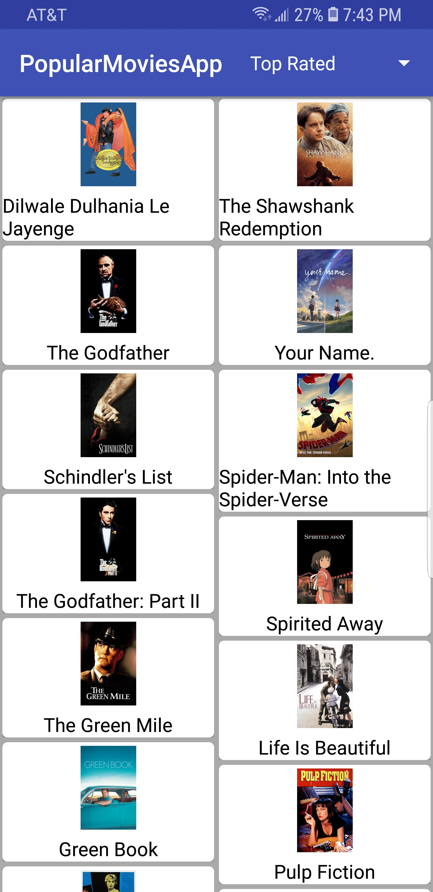

# NewFlix - latestMoviesApp
Android App

NewFlix app is designed to help users find the latest movies and their ratings with ability to sort films by popularity.

<ul>
<li>Designed app layout with RecyclerView with a grid layout to simplify UI to 2 screens instead of building screens for every page from list of 100s of movies retrieved from <b style="color:blue;">themoviesDB.org</b>.</li>
<li>Implemented infinite page scroll using Recyclerview and Paging library, avoiding multiple network calls to themoviesDB.org, enabling users to scroll through all 20,000 results without clicking.</li>
</ul>

    
    
    

