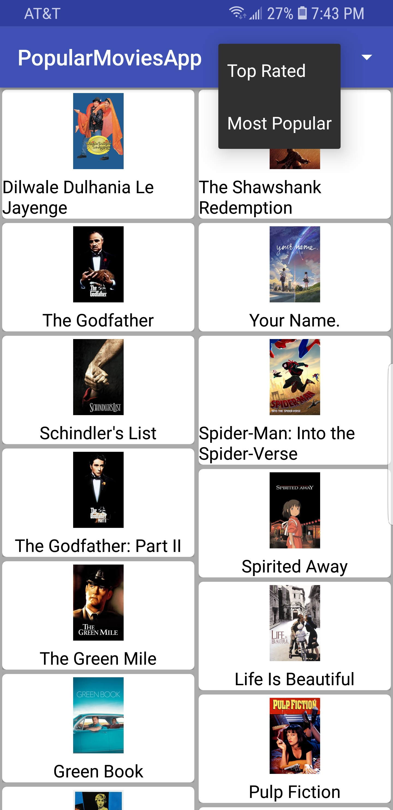
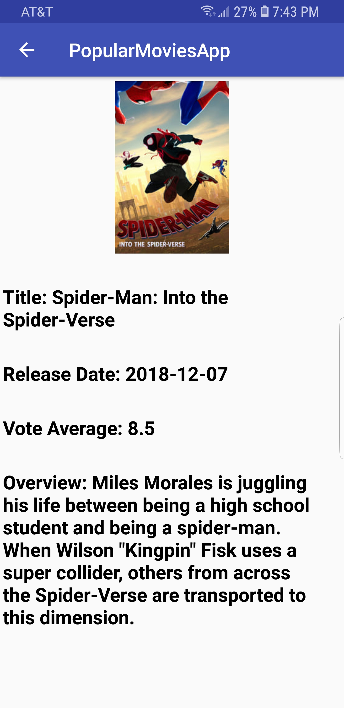

# NewFlix - latestMoviesApp
Android App

NewFlix app is designed to help users find the latest movies and their ratings with ability to sort films by popularity.

<ul>
<li>Designed the app's layout using RecyclerView with grid layout made the UI simple with 2 screens (or activity)
instead of creating a screen (activity) for every page of the list of movies retrieved from <b>themoviesDB.org </b>. </li>
<li>The users are provided with a sort option to list movies based on ratings or popularity. </li>
<li>Implemented infinite page scroll using the Recyclerview and Paging library and helped avoid making multiple
    network calls to themoviesDB.org.</li>
    <li> Users were able to scrolls through all 20000 results from approximately 990
    pages of movies without having to make clicks/touches for each page. </li>
</ul>

### NewFlix - LatestMoviesApp UI Function
<ol>
    <li>Movies are displayed in the main layout through a grid of their corresponding movie poster </li>
    <li>Contains a spinner element to toggle the sort order of the movies by: 1.most rated 2.most popular </li>
    <li>Contains a screen to display the details of the selected movie</li>
</ol>

    
    
    

